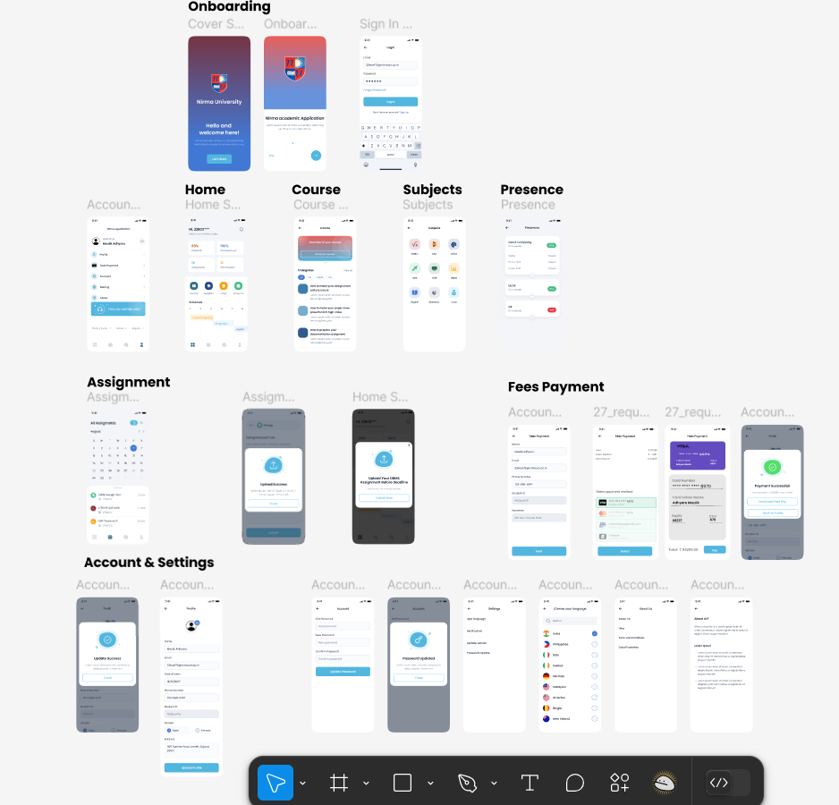

# University-AcademicUI-UX-design
This Design can be viewed on: https://www.behance.net/gallery/223185755/Nirma-App

# 🎨 College Academic UI/UX Design  

This repository contains the **UI/UX design for a college academic system**, created using **Figma**. The design focuses on an intuitive user experience, covering essential academic functionalities.  

## 📌 Key Screens  
- **Login Page**: Secure authentication for students and faculty.  
- **Home Page**: Dashboard with quick access to key features.  
- **Subject List Page**: Displays enrolled subjects and relevant materials.  
- **Settings Page**: Personalization and account management options.  
- **Payment Page**: Fees payment system with multiple methods (Visa, PayPal, Cheque).  
- **Feedback Page**: Allows users to submit feedback and queries.  

## 🎨 Features  
- **High-Fidelity Design**: Modern UI components with seamless navigation.  
- **User-Centric Layout**: Ensures ease of access and intuitive workflows.  
- **Usability Tested**: Evaluated for responsiveness, efficiency, and accessibility.  

## 📝 Usability Testing  
The project was **tested for usability**, with improvements suggested in:
- **Navigation enhancements** (e.g., breadcrumb navigation).  
- **Improved readability** (larger fonts, better contrast).  
- **Better mobile responsiveness** (fixing layout glitches).  

## 🛠 Tools Used  
- **Figma** – UI/UX design and prototyping.  
  
